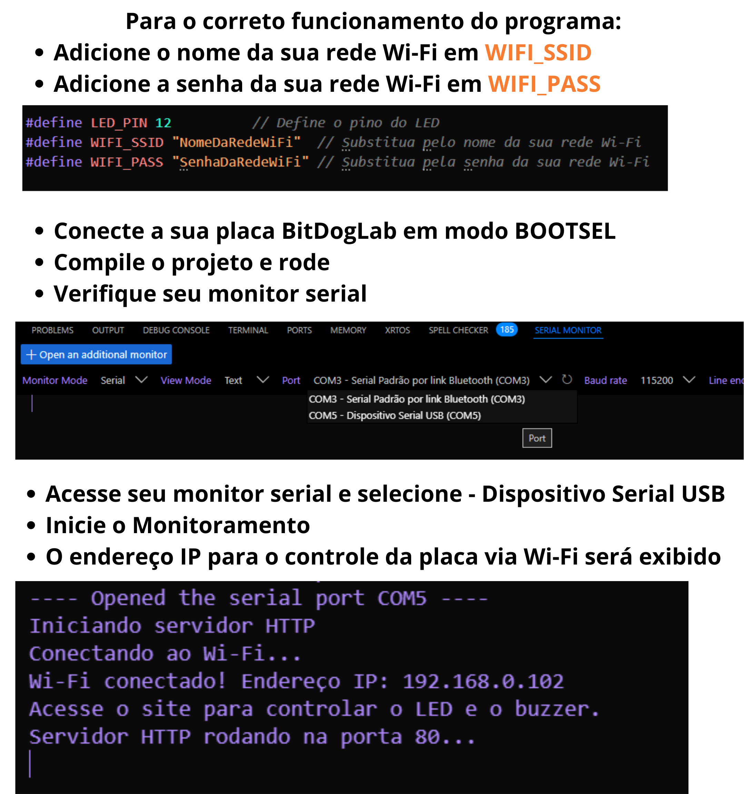
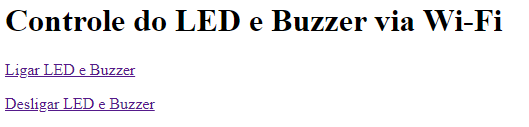

## Instruções:

Instruções para execução do programa

  

## Pré-requisitos

1. Ambiente Configurado:
    * Instale o Raspberry Pi Pico SDK.

            i. Iniciar um projeto C/C++ na extensão da raspberry pi pico;

            ii. Mudar o tipo da placa para pico w;

            iii. Ir em “Pico wireless options” e clicar em background lwIP

    * Certifique-se de que as bibliotecas ***pico_cyw43_arch_lwip_threadsafe_background*** estão configuradas corretamente.

2. Credenciais de Wifi: Substitua o nome e a senha do Wi-Fi no código.

**OBS: Não se esqueça de colocar o nome e senha da sua rede wifi no campo designado no início do código!**

3. Após a compilação, o arquivo .uf2 estará disponível no diretório build. Faça o upload para a Pico W.
4. Com o código compilado e feito o upload na placa, é possível controlar o LED RGB central da placa pesquisando pelo endereço IP em que a placa está conectada em um navegador.
5. Ao entrar no endereço IP vai abrir uma página com o formato mostrado a seguir. Com isso clique em Ligar LED e Buzzer ou Desligar LED e Buzzer para enviar para a placa a sua necessidade:

**Nota: Caso a tela não apareça para você, apenas entre na página do endereço IP no buscador e adicione /led_buzzer/on ao endereço para ligar o LED ou /led_buzzer/off para desligar.**

"# LED-e-Buzzer-via-Wi-Fi-com-Raspberry-Pico-W-e-BitDogLab" 
"# LED-e-Buzzer-via-Wi-Fi-com-Raspberry-Pico-W-e-BitDogLab" 
"# LED-e-Buzzer-via-Wi-Fi-com-Raspberry-Pico-W-e-BitDogLab" 
